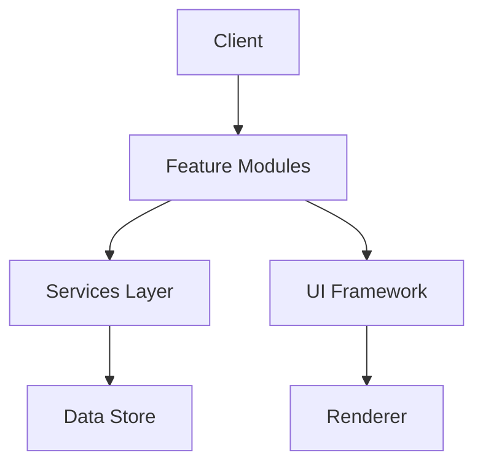

# Skollor Roblox Project Architecture

## Overview
The Skollor Roblox Project is built with a modular, scalable architecture designed for high performance and maintainability.

## Core Systems

### 1. Feature Modules
- Trading System
- World Map
- Server Management
- Player Analytics
- UI Components

### 2. Services Layer
- Analytics Service
- Data Management
- Performance Monitoring
- Security Service

### 3. UI Framework
- Theme System
- Component Library
- Animation Manager
- Layout Engine

## Data Flow

## Performance Considerations
- Efficient data structures
- Optimized rendering
- Smart caching
- Network optimization

## Security Measures
- Anti-exploit systems
- Data validation
- Secure communications
- Anti-cheat integration